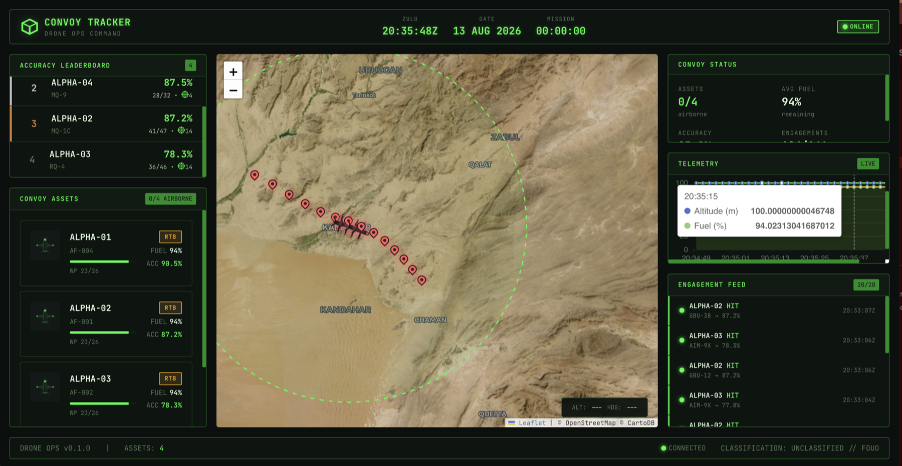
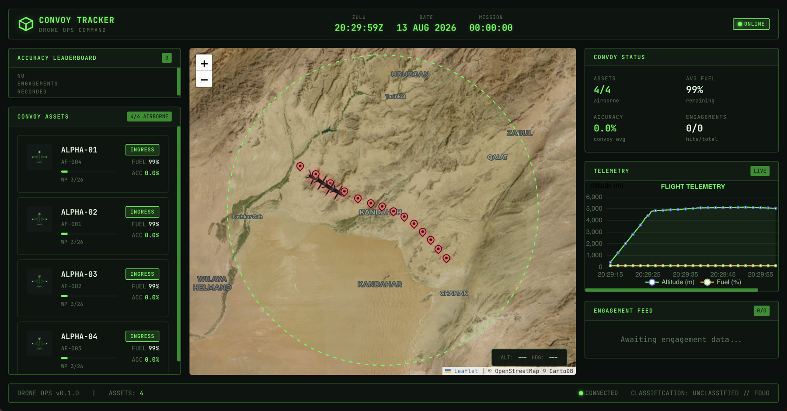
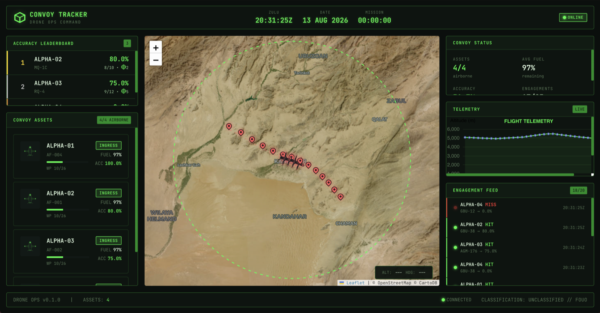
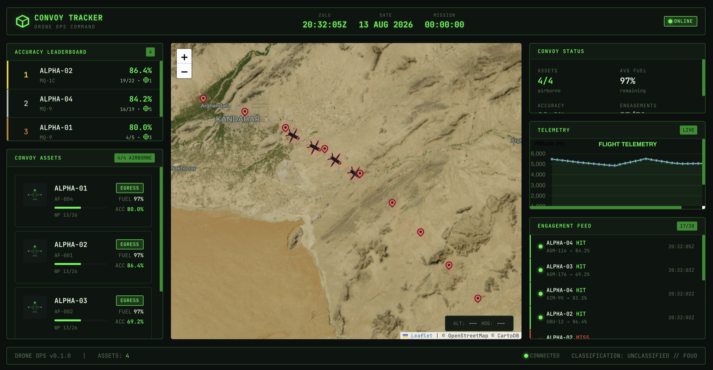
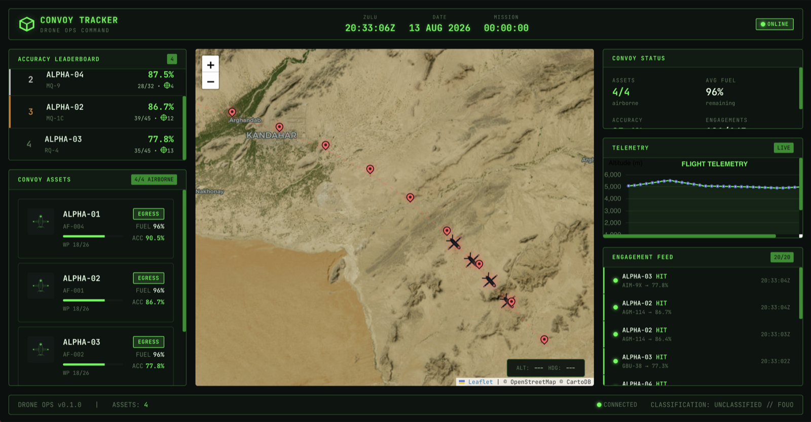

##  DoD Attack Drone Convoy Tracking System (Rust)

The provided Rust application is a full-stack DoD attack drone convoy tracking system using a WebAssembly native Rust Letpos frontend reading realtime WebSocket drone status telemetry, GraphQL drone leader tracking on the server-side using Redis RW cache cluster and ScyllaDB NoSQL DB (ScyllaDB is 100% rewrite of Cassandra DB NoSQL in C++).


See the following screenshots of systems frontend.

Screenshot 1


Screenshot 2


Screenshot 3


Screenshot 4 


Screenshot 5 



## Project Structure

```shell
drone-convoy-tracker
├── Cargo.lock
├── Cargo.toml
├── Makefile
├── README.md
├── assets
│   ├── fonts
│   └── images
│       ├── drone.svg
│       ├── explosion.svg
│       └── target-streak.svg
├── config
│   └── app.toml
├── containers
│   ├── Containerfile.api
│   ├── Containerfile.frontend
│   ├── nginx.conf
│   ├── podman-compose.dev.yml
│   ├── podman-compose.yml
│   └── prometheus.yml
├── crates
│   ├── drone-analytics
│   │   ├── Cargo.toml
│   │   └── src
│   │       ├── engine.rs
│   │       ├── error.rs
│   │       ├── lib.rs
│   │       ├── queries.rs
│   │       └── reports.rs
│   ├── drone-domain
│   │   ├── Cargo.toml
│   │   └── src
│   │       └── lib.rs
│   ├── drone-frontend
│   │   ├── Cargo.toml
│   │   ├── Trunk.toml
│   │   ├── assets
│   │   ├── index.html
│   │   ├── src
│   │   │   ├── components
│   │   │   │   ├── charts.rs
│   │   │   │   ├── drone_card.rs
│   │   │   │   ├── engagement_feed.rs
│   │   │   │   ├── footer.rs
│   │   │   │   ├── header.rs
│   │   │   │   ├── leaderboard.rs
│   │   │   │   ├── map.rs
│   │   │   │   └── mod.rs
│   │   │   ├── lib.rs
│   │   │   ├── main.rs
│   │   │   ├── services
│   │   │   │   ├── api.rs
│   │   │   │   ├── mod.rs
│   │   │   │   └── websocket.rs
│   │   │   └── state
│   │   │       └── mod.rs
│   │   └── style
│   │       └── main.css
│   ├── drone-graphql-api
│   │   ├── Cargo.toml
│   │   └── src
│   │       ├── config.rs
│   │       ├── context.rs
│   │       ├── error.rs
│   │       ├── lib.rs
│   │       ├── loaders
│   │       │   └── mod.rs
│   │       ├── main.rs
│   │       ├── resolvers
│   │       │   ├── mod.rs
│   │       │   ├── mutation.rs
│   │       │   ├── query.rs
│   │       │   └── subscription.rs
│   │       └── schema
│   │           ├── enums.rs
│   │           ├── inputs.rs
│   │           ├── mod.rs
│   │           └── objects.rs
│   ├── drone-persistence
│   │   ├── Cargo.toml
│   │   └── src
│   │       ├── cache
│   │       │   ├── mod.rs
│   │       │   └── redis_client.rs
│   │       ├── error.rs
│   │       ├── lib.rs
│   │       ├── repository
│   │       │   ├── mod.rs
│   │       │   └── scylla_impl.rs
│   │       └── strategy
│   │           ├── mod.rs
│   │           ├── read_strategy.rs
│   │           └── write_strategy.rs
│   └── drone-simulator
│       ├── Cargo.toml
│       └── src
│           ├── convoy.rs
│           ├── engagement.rs
│           ├── flight.rs
│           ├── lib.rs
│           ├── main.rs
│           └── telemetry.rs
├── deploy
├── docs
│   ├── Screenshot 2026-08-13 at 22.30.00.png
│   ├── Screenshot 2026-08-13 at 22.31.26.png
│   ├── Screenshot 2026-08-13 at 22.32.06.png
│   ├── Screenshot 2026-08-13 at 22.33.07.png
│   └── Screenshot 2026-08-13 at 22.35.49.png
└── schema
    └── cql
        ├── 000_keyspace_dev.cql
        ├── 000_keyspace_prod.cql
        ├── 001_core_schema.cql
        └── 002_waypoint_columns.cql
```


## The Architecture of the DoD Attack Drone Tracking Service

The system is five Rust crates behind one workspace, arranged so that every
layer owns exactly one concern and the data flows in a single direction:

```
drone-simulator ──GraphQL mutations──▶ drone-graphql-api ──▶ drone-persistence ──▶ ScyllaDB
                                             │                      │
                                             │                      └──▶ Redis (leaderboard read cache)
                                             ▼
                                   drone-frontend (Leptos/WASM)
                                   2s GraphQL polling + /graphql/ws subscriptions
```

**Transports.** Three distinct transports, each chosen for what it carries:

- **GraphQL over HTTP (axum + async-graphql)** is the command-and-query plane.
  The simulator posts `recordTelemetry`, `updateDroneState` and
  `recordEngagement` mutations every tick; the dashboard polls `leaderboard`,
  `drones` and `engagements` on a 2-second cadence. Every HTTP caller in the
  codebase parses the GraphQL `errors[]` array rather than trusting the HTTP
  status — GraphQL rejections arrive in a 200 OK body, and a caller that only
  checks status logs success while writing nothing.
- **GraphQL subscriptions over WebSocket** are mounted at `/graphql/ws`
  (graphql-ws protocol), wired to tokio broadcast channels inside the API.
  The dashboard currently ships on polling with subscriptions as the upgrade
  path; both transports read identical types, so the swap is additive.
- **CQL native protocol** between the API and ScyllaDB via the `scylla` driver
  (shard-aware, prepared statements throughout).

**Enum wire contract.** All digit-bearing GraphQL enum variants
(`MQ9_REAPER`, `AGM114_HELLFIRE`, ...) carry explicit `#[graphql(name)]` pins.
async-graphql's SCREAMING_SNAKE_CASE rename runs through the Inflector crate,
which treats digits as uppercase and would register `MQ_9_REAPER` — silently
rejecting every value the clients send. The pins remove the rename engine from
the contract; do not trust automatic renames for variants containing digits.

**ScyllaDB schema design.** ScyllaDB is queried by partition, so the schema
is laid out per read path rather than normalized (`schema/cql/`):

- `convoys`, `drones` — row-per-entity state, drones partitioned by convoy.
  `drones` also denormalizes engagement counters so the drone-card ACC readout
  is one partition read.
- `waypoints` — partitioned by drone, clustered by sequence number: a route is
  one ordered partition scan.
- `telemetry` — time-series partitioned by `(drone_id, hour_bucket)` with
  time-descending clustering, so "latest N" and "last hour" are single-
  partition reads and partitions cannot grow unbounded.
- `engagements` and `engagements_by_drone` — the same event dual-written in
  one logged batch, because "per convoy" and "per drone" are different
  partition keys and ScyllaDB does not do secondary-index reads cheaply.
- `leaderboard` — partitioned by convoy, clustered by `accuracy_pct DESC`, so
  the ranking IS the storage order. Because the ordering column is a
  clustering key it cannot be UPDATEd in place: a score change is a
  DELETE + INSERT of the row inside a single-partition logged batch (atomic
  at partition scope).
- Custom UDTs (`coordinates`, `target_info`) mirror Rust structs derived with
  `SerializeValue`/`DeserializeValue`, field names matched to the CQL types.

**Redis RW cache.** The leaderboard read path is cached in Redis with a short
TTL; every leaderboard write invalidates the key, so the dashboard's 2-second
poll amortizes to cache hits between engagements while never serving a stale
ranking after one. Cache failures degrade to ScyllaDB reads — Redis is an
accelerator, never a source of truth.

**Determinism as a feature.** The simulator derives drone UUIDs as UUIDv5 of
the callsign (`ALPHA-01` is the same UUID on every machine, every run), and
pins its convoy to a well-known demo UUID (`DRONE_CONVOY_ID` overrides).
Restarts therefore overwrite state instead of accumulating ghost fleets, and
every GraphQL example in this README is reproducible verbatim in the
playground.

**Resilience.** The simulator probes `{ health }` until the API is up before
its one-shot bootstrap, and drone identity rides on every per-tick
`updateDroneState` (an idempotent read-merge-write upsert) — a lost
registration self-heals within one tick.


## Build Prerequisites 

Native toolchain (the default `make serve` path runs the API and frontend
natively; containers are used only for the databases):

| Requirement | Version | Why |
|---|---|---|
| Rust toolchain (rustup) | **1.85+** (edition 2024) | workspace edition; older toolchains fail immediately |
| `wasm32-unknown-unknown` target | — | Leptos frontend (`rustup target add wasm32-unknown-unknown`) |
| Trunk | 0.21+ | WASM build + dev server (`cargo install trunk`) |
| Podman | 4.x+ | runs ScyllaDB and Redis (Docker works identically) |
| podman-compose | 1.x | only for the all-in-containers `make stack-up` path |
| GNU Make | any | the front door; every workflow is a `make` verb |
| ~6 GB free RAM | — | ScyllaDB is a C++ database that takes its memory seriously |

No Node, no npm, no Python: the frontend toolchain is entirely Rust.
ScyllaDB schema application is explicit (`make` targets drive `cqlsh` inside
the container) — ScyllaDB has no `/docker-entrypoint-initdb.d` convention, so
do not expect mounted init scripts to run.


## Building the Project

```shell
make build          # touch sweep + full workspace build (API, frontend, simulator)
make serve          # starts ScyllaDB+Redis (podman), applies schema, runs API
                    #   (release) + Trunk dev server natively
make run-simulator  # second terminal: flies the ALPHA convoy for one mission

OR

make run-simulator THEATER=syria → pick SYRIA in the header
```

Dashboard at `http://localhost:3000`, GraphQL playground at
`http://localhost:8080/graphql`. First database boot takes ~60s; subsequent
runs reuse the running containers. `make db-reset` drops the keyspace inside
the running container (seconds) for a clean demo; `make stop` stops the
databases; `make help` lists the full front door.

Two Make behaviors worth knowing rather than discovering:

- `make build` runs a `touch` sweep first, because overlaying delivery zips
  restores archive mtimes and Cargo would otherwise skip "older" files.
  `TOUCH=0` opts out.
- `make serve` builds API and frontend in parallel; the simulator's
  `wait_for_api` probe exists precisely so a race against the API's release
  build cannot lose the bootstrap.

The mission runs ~5 minutes. Engagements fire only between 25% and 75% of
mission progress — an empty leaderboard in the first ~75 seconds is correct
behavior, not a defect. At mission end, the simulator prints its FINAL
LEADERBOARD; the playground `leaderboard` query must match it exactly, which
is the end-to-end integrity check for the whole pipeline.

Container images (`containers/Containerfile.api`, `.frontend`) build with a
parameterised `ARG RUST_VERSION` (≥1.85) for the `make stack-up` path.


## References 

- Rust Leptos 
https://leptos.dev/

- ScyllaDB
https://www.scylladb.com/

- Rust Crates Registry
https://crates.io/

- Rust Site
https://rust-lang.org/


